# MBA EM BUSINESS INTELLIGENCE E BIG DATA 

###  Banco de dados SQL e NoSQL

#### Wandeilson Ferreira 

## Índice

- [Apresentação da disciplina](#Apresentação-da-disciplina)
- [Sobre o MongoDB](#sobre-o-MongoDB)
- [Atividade 01](#Atividade-01)
- [Sobre o Neo4j](#Sobre-o-Neo4j)
- [Atividade 02](#Atividade-02)
- [Atividade 03](#Atividade-03)


## Apresentação da disciplina 

A disciplina de Persistência de Dados em Bancos NoSQL, ministrada pelo professor [Daniel Brandão](https://www.linkedin.com/in/profdanielbrandao/) tem como objetivo proporcionar uma compreensão sólida dos fundamentos dos bancos de dados, abordando tanto os modelos relacionais quanto os não relacionais. 

Ao longo do curso, foram exploram conceitos essenciais de modelagem de bancos de dados relaciona e não relacional. A disciplina trouxe uma revisão dos conseitos de linguagem SQL e apllicou conceitos práticos com MongoDB, Neo4j, Hbase Firebase e Redis, cada um com características específicas voltadas para documentos, grafos, tempo real e armazenamento em memória. 

A metodologia aplicada na disciplina foi estruturada com base na integração entre teoria e prática em laboratório, favorecendo a consolidação do aprendizado e o desenvolvimento de habilidades técnicas essenciais para o trabalho com persistência de dados em diferentes modelos de banco.

## Sobre o MongoDB
O MongoDB é um banco de dados NoSQL de código aberto, projetado para armazenar e gerenciar dados orientados a documentos. Diferente dos bancos de dados relacionais tradicionais que utilizam tabelas com linhas e colunas, o MongoDB organiza os dados em documentos flexíveis no formato BSON (uma extensão binária do JSON). Isso o torna ideal para aplicações que precisam de flexibilidade e escalabilidade.

### Principais Características
- Armazenamento Orientado a Documentos: Os dados são armazenados em documentos semelhantes a JSON, permitindo estruturas complexas e flexíveis.
- Design Sem Esquema: Não exige um esquema fixo, permitindo que documentos na mesma coleção tenham diferentes campos e estruturas.
- Alta Performance: Oferece suporte a índices avançados e utiliza arquivos mapeados na memória para operações rápidas de leitura e escrita.
- Escalabilidade Horizontal: Suporta sharding, permitindo distribuir dados em vários servidores para lidar com grandes volumes de informações.

<br>
<center>

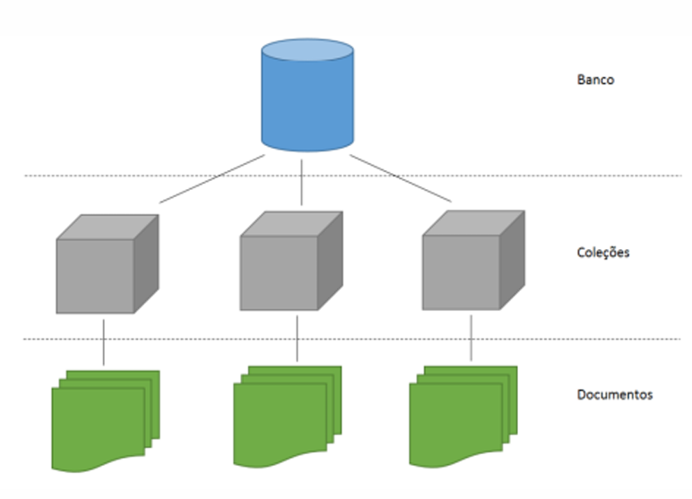
<figcaption>Modelagem de um banco NoSql</figcaption>

</center>


### Dowload e instalação:

O download pode ser feito atraves do site oficial do projeto, disponível em [mongodb.com](https://www.mongodb.com/try/download/community), onde será disponibilizada a instalaçao do MongoDB e Compass (interface grafica de gerenciamento e visualização de dados). 

### Criando o primeiro projeto no MongoDB Compass

Para o desenvolvimento dessa atividade optou-se por gerenciar o projeto localmente. Para tando, seguimos os sequintes passos:

<center>

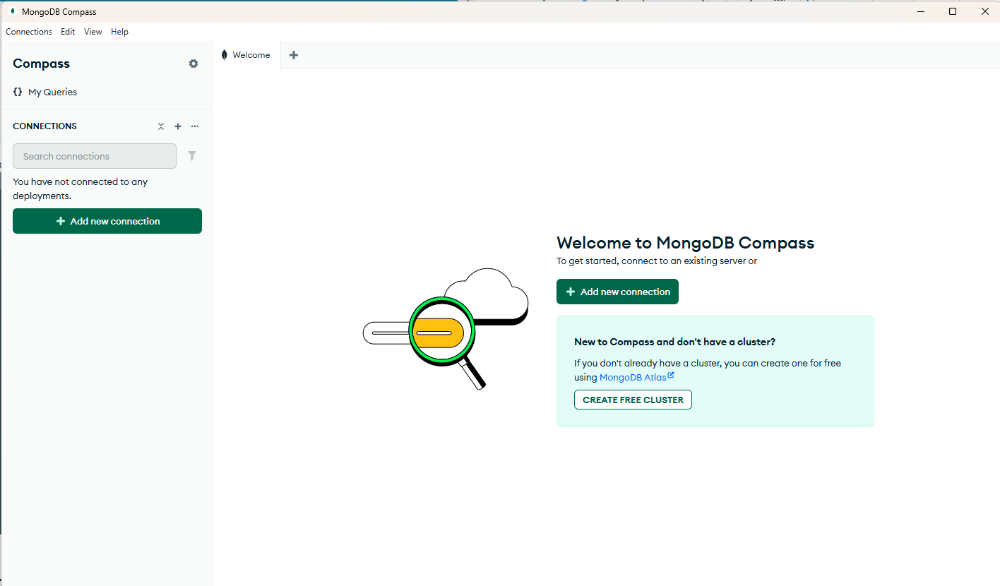
<figcaption>MongoDB Compass</figcaption>

</center>

### Criando uma nova conexão 

<center>

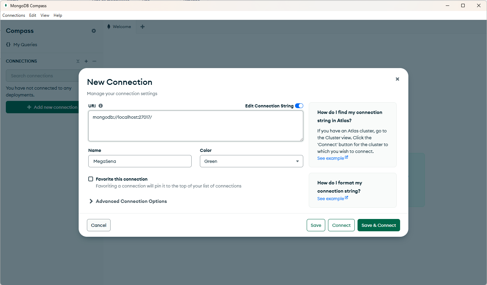
<figcaption>Nova conexão</figcaption>

</center>

Uma vez Criada a conexão Podemos criar a base de dados e as coleções: 

<center>
<br>

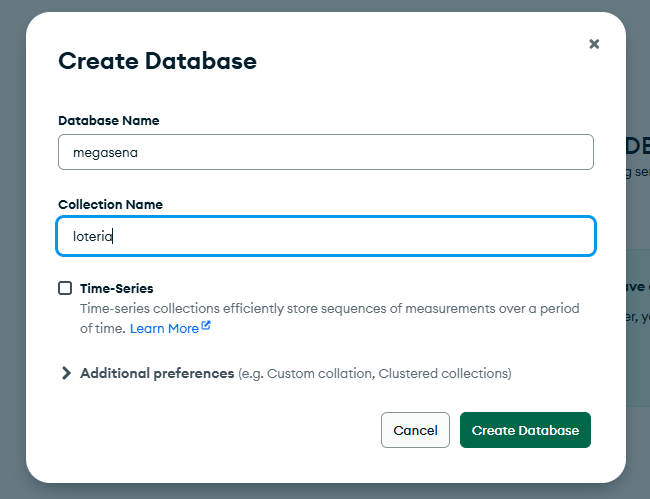
<figcaption>Criando a base de dados</figcaption>
<br>
</center>

O proximo passo será importar a base dados “megasena2.csv” para iniciarmos a análise. 
<br>
<center>

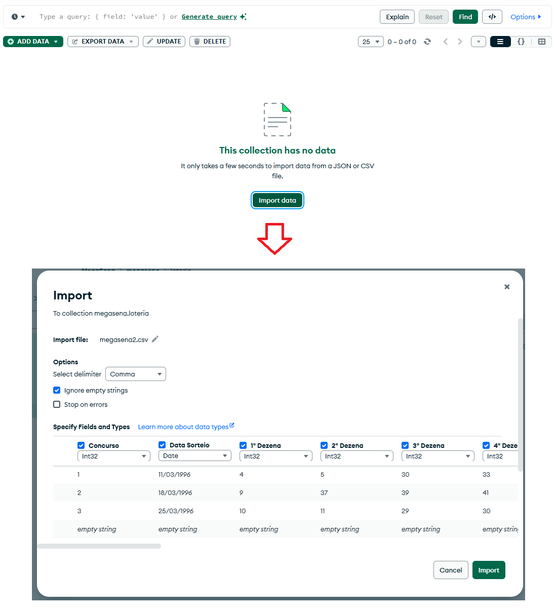
<figcaption>Importanto a base de dados</figcaption>

<br>
</center>


> Para essa atividade os dados foram utilizados de forma bruta, não passando por nenhum tipo de tratamento. 

<center>

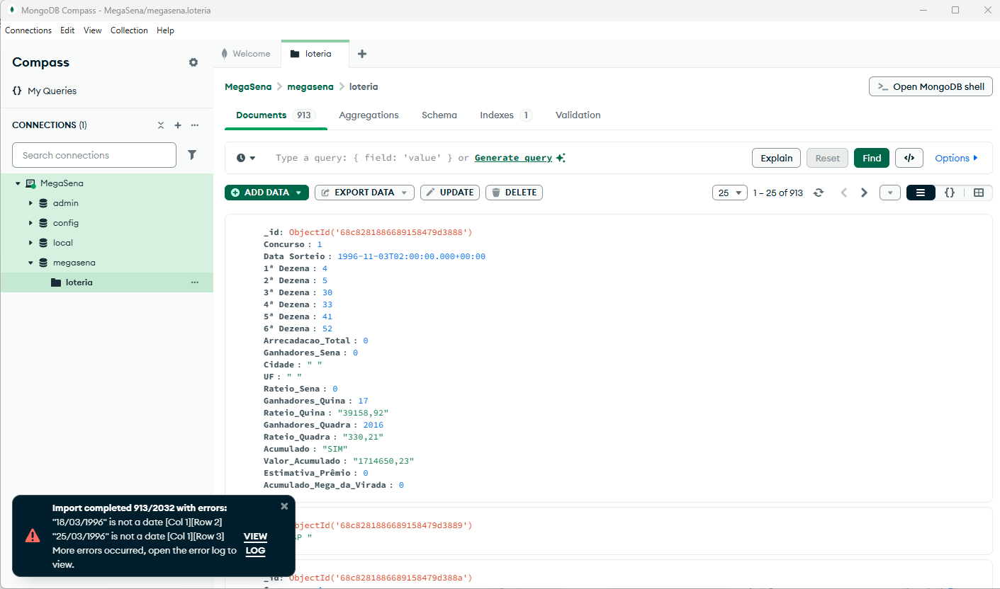
<figcaption>Erro de importação</figcaption>

<br>
</center>

> Dessa forma, apresentou-se uma seria de erros na importação que não seram tratados nesse momento. 

> Tela do MongDB shell

<center>

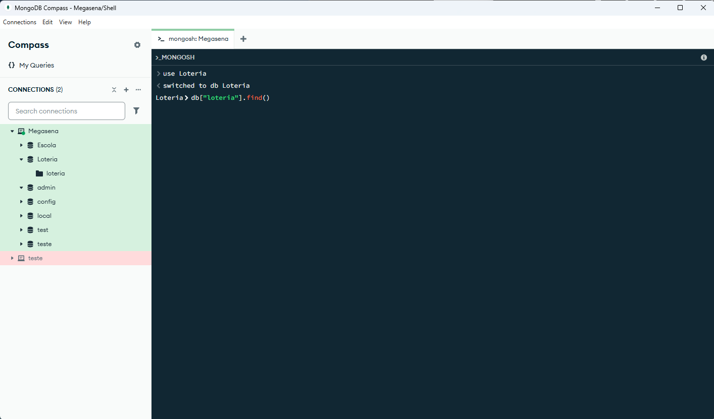
<figcaption>MongDB shell</figcaption>

<br>
</center>


### Operações Básicas - CRUD

### CREATE
```
Create/Insert no MongoDB
db.collection.insertOne({ nome: "João", idade: 30 })
db.collection.insertMany([{ nome: "Ana" }, { nome: "Carlos" }])
```

### READER
```
Consulta no MongoDB
db.collection.find() // Retorna todos os documentos
db.collection.find({ idade: { $gt: 25 } }) // Filtra por idade maior que 25
db.collection.findOne({ nome: "João" }) // Retorna apenas um documento
```
#### Principais tags de consulta

<center>

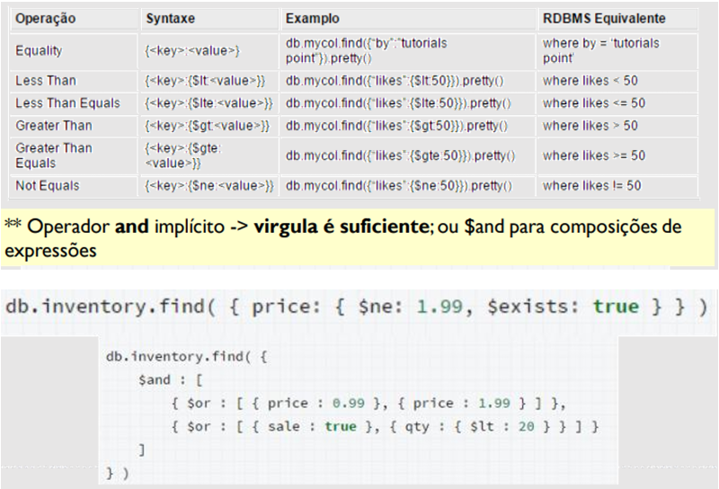
<figcaption>MongDB shell</figcaption>

<br>
</center>


### UPDATE 
```
db.collection.updateOne(
  { nome: "João" },
  { $set: { idade: 31 } }
)

db.collection.updateMany(
  { ativo: true },
  { $set: { status: "verificado" } }
)

db.collection.replaceOne(
  { nome: "Carlos" },
  { nome: "Carlos", idade: 40, ativo: false }
)

db.minhanovacoleção.update( { "nome" : "Alvara" }, {
	$set: {"idade" : 57, hobbies: ["judo", "filmes"], endereço: {
	rua: "KK", num: 305, apto: 202 } } }, { upsert: true })
	· Upsert -> Busca um registro; se ele existir, atualiza, senão, cadastra

```

### DELETE

```
db.collection.deleteOne({ nome: "Ana" })
db.collection.deleteMany({ ativo: false })

db.collection.deleteMany({}) → Deleta todos os documentos da coleção

```

### Filtros simples
```
db.clientes.find({ nome: "Daniel" }) 
db.clientes.find({ email: "daniel@gmail.com" })
```


## Atividade 01 
### Objetivo da atividade

Apresentar os fundamentos dos bancos de dados não relacionais, com ênfase na realização de consultas em bancos NoSQL orientados a documentos.  


### Encontre todos os concursos onde houve acumulo de prêmio
```
db.loteria.find({
	Acumulado: { $eq: "SIM" }}),
	{Concurso: 1, Arrecadacao_Total: 1}
	).sort({ Valor_Acumulado: -1 })
```

###  Liste os 10 concursos com maior arrecadação
```
db.loteria.find(
	{Arrecadacao_Total: { $gt: 0}},
	{ Concurso:1, Arrecadacao_Total: 1, _id:0 }
	).sort({Arrecadacao_Total: -1}).limit(10)
```

### Encontre os concursos onde não houve ganhadores da sena
```
db.loteria.find(
  	{ Ganhadores_Sena: { $eq: 0 } },
  	{ Concurso: 1, Ganhadores_Senal: 1, _id: 0 }
)
```

### Verificando o numero de concursos sem ganhadores
```
db.loteria.find(
  	{ Ganhadores_Sena: { $eq: 0 } },
  	{ Concurso: 1, Ganhadores_Senal: 1, _id: 0 }
	).count()
```

### Consultas com agregação
### Calcule a média de arrecadação por estado (UF)
```
 db.loteria.aggregate([
 	{ $group: { 
		_id: "$UF", 
		total_arrecadado: { $sum: "$Arrecadacao_Total" },
		media_arrecadacao: { $avg: "$Arrecadacao_Total" }
	}},
 	{ $sort: { total_arrecadado: -1 } }
 	])
```

### Encontre os 10 números mais sorteados em todos os concursos
```
 db.loteria.aggregate([
 { $project: { 
		numeros: { $concatArrays: [
		["$1ª Dezena"], ["$2ª Dezena"], ["$3ª Dezena"],
		["$4ª Dezena"], ["$5ª Dezena"], ["$6ª Dezena"]
		]} 
}},
 { $unwind: "$numeros" },
 { $group: { _id: "$numeros", total: { $sum: 1 } } },
 { $sort: { total: -1 } },
 { $limit: 10 }
 ])


```

### Identifique quais cidades tiveram mais ganhadores da sena
```
 db.loteria.aggregate([
 	{ $group: { 
		_id: "$Cidade", 
		Ganhadores_Sena: { $sum: "$Ganhadores_Sena" },		 
	}},
 	{ $sort: { Ganhadores_Sena: -1 } }
 	])
```

### Análise temporal
### Crie uma análise mensal da arrecadação total
```
db. loteria. aggregate([
	{
		$addFields: {
			Mes: { $month: "$Data Sorteio" },
			Ano: { $year: "$Data Sorteio" }
			}
		},		 
		{
		$group: {
			_id: { ano: "$Ano", mes: "$Mes" },
			Total_Arrecadado: { $sum: "$Arrecadacao_Total" },
			Total_Acumulado: {
				$sum: {
					$cond: [ { $eq: ["$Acumulado", "SIM"] }, "$Valor_Acumulado", 0 ]
					}
				},

		Sorteios_Acumulados: {
			$sum: {
				$cond: [ { $eq: ["$Acumulado", "SIM"] }, 1, 0 ]
			}
		},
		
		Total_Sorteios: { $sum: 1 }
			} 
		},
		{ 
		$sort: { "_id.ano": 1, "_id.mes": 1 }
	}		
])
```

### Verifique se há tendências sazonais nos prêmios acumulados
Apresenta as variações sazonais — ou seja, se há meses ou épocas do ano em que os prêmios acumulados tendem a ser maiores ou menores.

```
db.loteria.aggregate([
  {
    $addFields: {
      mes: { $month: "$Data_Sorteio" },
      ano: { $year: "$Data_Sorteio" }
    }
  },
  {
    $group: {
      _id: "$mes",
      media_acumulado: { $avg: "$Valor_Acumulado" },
      total_acumulado: { $sum: "$Valor_Acumulado" },
      sorteios: { $sum: 1 }
    }
  },
  {
    $sort: { _id: 1 }
  }
])
```

### Calcule a média móvel de 6 meses para o valor acumulado

```
db.sorteios.aggregate([
  {
    $addFields: {
      ano: { $year: "$Data_Sorteio" },
      mes: { $month: "$Data_Sorteio" },
      semestre: {
        $cond: [
          { $lte: [{ $month: "$Data_Sorteio" }, 6] },
          1,
          2
        ]
      }
    }
  },
  {
    $group: {
      _id: { ano: "$ano", semestre: "$semestre" },
      media_acumulado_6m: { $avg: "$Valor_Acumulado" },
      total_sorteios: { $sum: 1 }
    }
  },
  {
    $sort: { "_id.ano": 1, "_id.semestre": 1 }
  }
])
```

### Estatísticas avançadas

### Calcule a probabilidade de cada número ser sorteado
```
db.loteria.aggregate([  
  { 
    $project: {
      numeros: {
        $concatArrays: [
          ["$1ª Dezena"], ["$2ª Dezena"], ["$3ª Dezena"],
          ["$4ª Dezena"], ["$5ª Dezena"], ["$6ª Dezena"]
        ]
      }
    }
  },
  
  { $unwind: "$numeros" },
  
  { $group: { _id: "$numeros", total_sorteios: { $sum: 1 } } },
  
  {
    $group: {
      _id: null,
      numeros: { $push: { numero: "$_id", total_sorteios: "$total_sorteios" } },
      total_geral: { $sum: "$total_sorteios" }
    }
  },
  
  { 
    $project: {
      numeros: {
        $map: {
          input: "$numeros",
          as: "nun",
          in: {
            numero: "$$nun.numero",
            total_sorteios: "$$nun.total_sorteios",
	    probabilidade: {
	    $multiply: [
	       { $divide: ["$$nun.total_sorteios", "$total_geral"] },
		100
	    ]
          }
        }
      }
    }
  }
])
```

### Identifique combinações de números que aparecem juntos com frequência

```
db.loteria.aggregate([
  {
    $project: {
      numeros: [
        "$1ª Dezena", "$2ª Dezena", "$3ª Dezena",
        "$4ª Dezena", "$5ª Dezena", "$6ª Dezena"
      ]
    }
  },
  {
    $project: {
      pares: {
        $reduce: {
          input: { $range: [0, { $size: "$numeros" }] },
          initialValue: [],
          in: {
            $concatArrays: [
              "$$value",
              {
                $map: {
                  input: {
                    $slice: ["$numeros", { $add: ["$$this", 1] }, { $size: "$numeros" }]
                  },
                  as: "n2",
                  in: [
                    { $arrayElemAt: ["$numeros", "$$this"] },
                    "$$n2"
                  ]
                }
              }
            ]
          }
        }
      }
    }
  },
  { $unwind: "$pares" },
  { $group: { _id: "$pares", total: { $sum: 1 } } },
  { $sort: { total: -1 } },
  { $limit: 10 }
])
```

### Analise a correlação entre arrecadação e número de ganhadores
```
db.loteria.aggregate([
  {
    $addFields: {
      arrecadacao: {
        $cond: [
          { $eq: [{ $type: "$Arrecadacao" }, "string"] },
          { $toDouble: { $replaceAll: { input: "$Arrecadacao", find: ",", replacement: "." } } },
          { $ifNull: ["$Arrecadacao", 0] }
        ]
      },
      ganhadores: { $ifNull: ["$Ganhadores", 0] }
    }
  },
  {
    $project: {
      Concurso: 1,
      arrecadacao: 1,
      ganhadores: 1
    }
  },
  {
    $sort: { arrecadacao: -1 }  
  },
  {
    $limit: 10  
  }
])
```
### Preparação para visualização

### Crie visualizações para os números mais sorteados

```
db.loteria.aggregate([
  { 
    $project: {
      numeros: { $concatArrays: [
        ["$1ª Dezena"], ["$2ª Dezena"], ["$3ª Dezena"],
        ["$4ª Dezena"], ["$5ª Dezena"], ["$6ª Dezena"]
      ]}
    }
  },
  { $unwind: "$numeros" },
  { $group: { _id: "$numeros", total_sorteios: { $sum: 1 } } },
  { $sort: { total_sorteios: -1 } },
   
]) 
```

### Prepare dados para um gráfico temporal da arrecadação

```
db.loteria.aggregate([
  {
    $group: {
      _id: {
        ano: { $year: "$data" },
        mes: { $month: "$data" }
      },
      total_arrecadado: { $sum: "$valor" }
    }
  },
  {
    $project: {
      periodo: {
        $concat: [
          { $toString: "$_id.ano" },
          "-",
          { $cond: {
            if: { $lt: ["$_id.mes", 10] },
            then: { $concat: ["0", { $toString: "$_id.mes" }] },
            else: { $toString: "$_id.mes" }
          }}
        ]
      },
      total_arrecadado: 1,
      _id: 0
    }
  },
  { $sort: { periodo: 1 } },
  { $out: "arrecadacao_por_mes" }
])
```

### Gere dados para um mapa de ganhadores por estado

```
db.loteria.aggregate([
  {
    $group: {
      _id: "$estado",
      total_ganhadores: { $sum: 1 },
      premio_total: { $sum: "$valor_premio" }
    }
  },
  {
    $project: {
      estado: "$_id",
      total_ganhadores: 1,
      premio_total: 1,
      _id: 0
    }
  },
  { $sort: { total_ganhadores: -1 } },
  { $out: "ganhadores_por_estado" }
])
```

## Sobre o Neo4j

Neo4j é um banco de dados NoSQL que utiliza o teorema dos grafos como base para armazenar e consultar informações, oferecendo uma abordagem poderosa para representar relações complexas entre dados. Em sua essência, um grafo é formado por nós e arestas: os nós representam entidades individuais, reunindo propriedades e valores de cada registro, enquanto as arestas conectam esses nós, indicando afinidades ou relações entre eles. Essa estrutura permite uma navegação intuitiva e eficiente pelos dados, destacando que, em um mundo cada vez mais orientado por informações, o verdadeiro valor está nas conexões que os dados estabelecem entre si.


### Principais Características
Os grafos são estruturas fundamentais no banco de dados Neo4j, onde podemos destacar: 

- Nós (Nodes): Representam entidades
- Arestas (Relationships): Conectam nós com direção e tipo
- Cypher que é a linguagem de consulta intuitiva do Neo4j. Ela 'desenha' o padrão que você quer encontrar no grafo.

### Criando o primeiro projeto
- Ascessando o sandbox
- Abrindo um projeto de exemplo
- Realizando consultas 
- Resultado 


## Atividade 02
### Objetivo da atividade
Realizar consultas no no Neo4j utilizando a linguagem Cypher

```
Consulta Cypher para ver os itens da base de dados: 

MATCH (n) RETURN n LIMIT 25

```

Consulta Cypher para listar os autores de um determinado filme e descobrir outros filmes que eles também atuaram.
Exemplo de busca: Matrix:

```
MATCH (m:Movie {title: "The Matrix"})<-[:ACTED_IN]-(a:Person)-[:ACTED_IN]->(other:Movie)
WHERE other.title <> "The Matrix"
RETURN a.name AS Ator, COLLECT(DISTINCT other.title) AS OutrosFilmes, COUNT(DISTINCT other) AS Total
ORDER BY Total DESC;

```

Consulta Cypher que analisa quais diretores trabalharam com quais atores, e quantas vezes essa colaboração aconteceu.

```

MATCH (d:Person)-[:DIRECTED]->(m:Movie)<-[:ACTED_IN]-(a:Person)
RETURN d.name AS Diretor, a.name AS Ator, COUNT(m) AS FilmesJuntos
ORDER BY FilmesJuntos DESC;

```

## Atividade 03
A terceira atividade da disciplina **(Porjeto final)** consiste no desenvolvimento de uma aplicação de controle de salários para uma empresa fictícia (SerGestor), integrando tecnologias modernas para gestão e visualização de dados. 

Para tal, será utilizando uma base de dados que armazenada em um banco de dados MongoDB para agerenciar as informações de forma estruturada e escalável, a aplicação opera de maneira online, permitindo acesso remoto e em tempo real. 

Além disso, será implementada uma conexão com o Power Bi para possibilitou a criação de dashboards interativo e análises visuais detalhadas sobre a distribuição salarial, histórico de pagamentos e indicadores financeiros, tornando o sistema uma ferramenta eficiente para tomada de decisões estratégicas.

### Desenvolvimento da aplicação

#### Crie uma conta no MongoDB Atlas
   Inicialmente acesse https://www.mongodb.com/cloud/atlas e registre-se com seu e-mail ou com uma conta GitHub/Google.
<br>
<center>

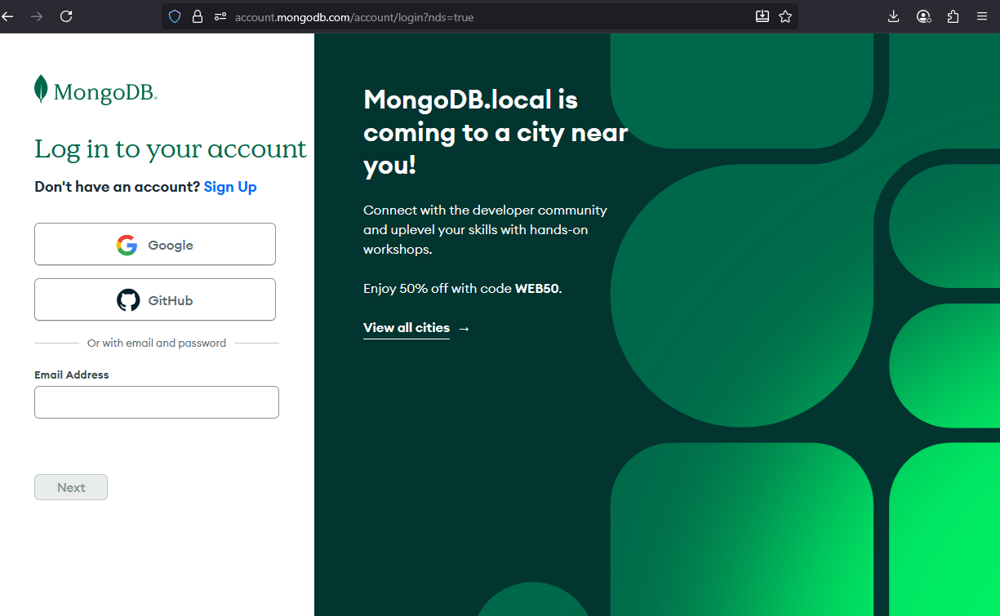
<figcaption>Criando uma conta no MongoDB</figcaption>

</center>

#### Crie um novo projeto
  - Após o login, clique em “New Project”.
  - Dê um nome ao projeto 
  - Click em Next

<br>
<center>

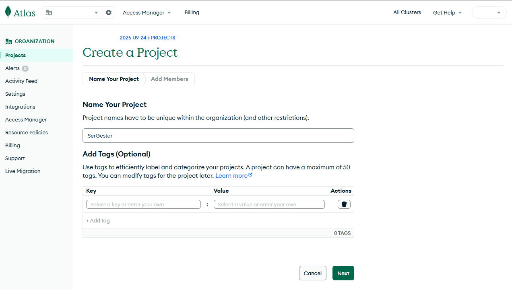
<figcaption>Criando um novo projeto</figcaption>

</center>
    
  - Adicione membros (opcional).
  - Click em Create Project

<center>

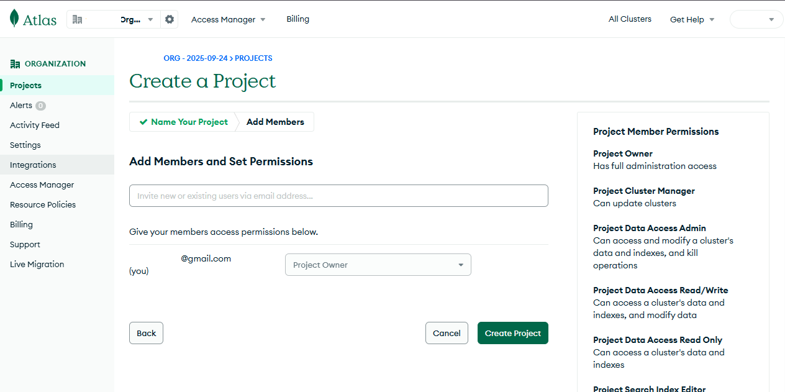
<figcaption>Criando um novo projeto</figcaption>

</center>
    
#### Configure um cluster
  - Dentro do projeto, clique em +Create para cirar um cluster.

<br>
<center>

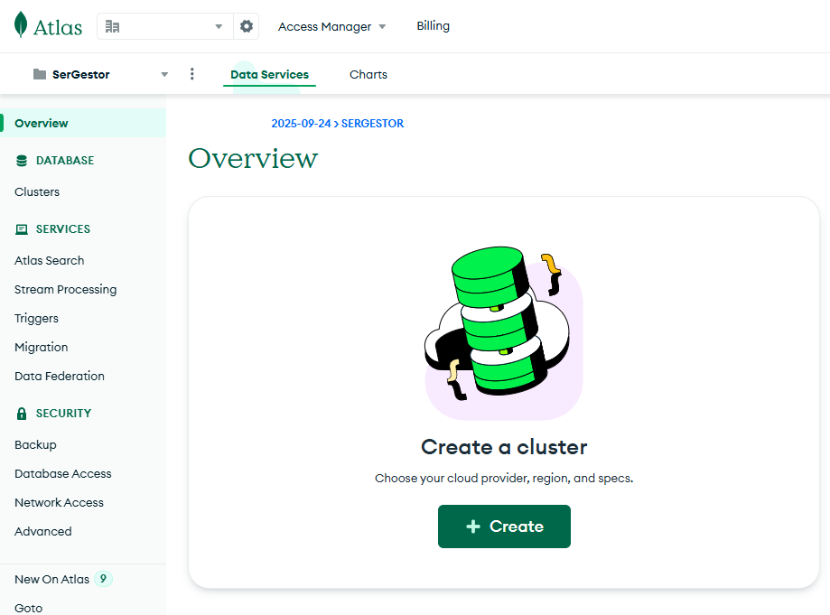
<figcaption>Criando um novo cluster</figcaption>

</center>
   
  - Neste ponto do projeto, precisamos escolher o plano que melhor se adequa às nossas necessidades. Como se trata de uma atividade acadêmica, optaremos pelo plano gratuito (Free), que já oferece uma série de recursos e pode ser expandido posteriormente.

<br>
<center>

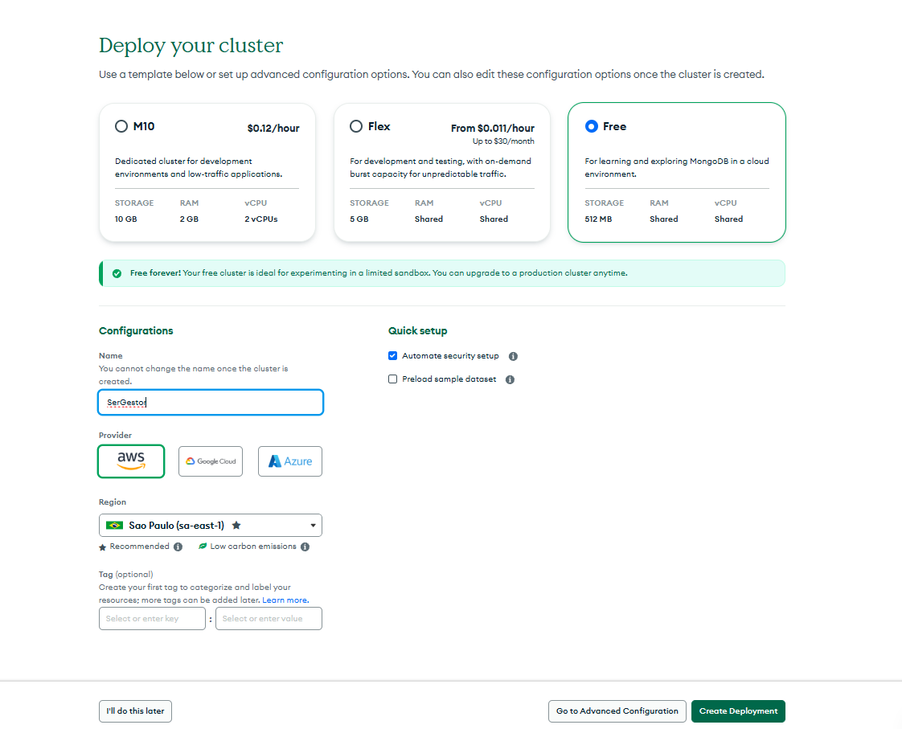
<figcaption>Selecionando as o cluster para a aplicação</figcaption>

</center>

#### Crie um usuário de banco de dados
  - Vá em “Database Access” no menu lateral.
  - Clique em “Add New Database User”.
  - Defina um nome de usuário e senha.
  - Escolha as permissões adequadas ("Read and write to any database").
<br>
<center>

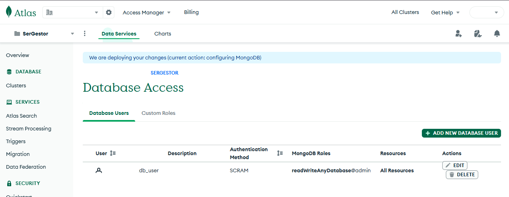
<figcaption>Criando o usuário</figcaption>

</center>

    
#### Configure o acesso à rede
  - Vá em “Network Access”.
  - Clique em “Add IP Address”.
  - Adicione o IP do seu computador ou selecione “Allow access from anywhere” (0.0.0.0/0).
<br>
<center>

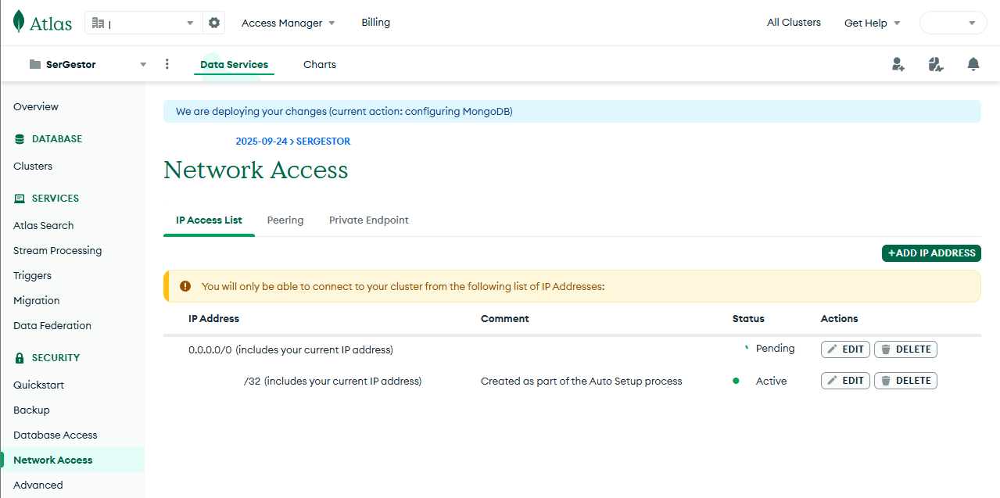
<figcaption>Configurando o acesso a usuarios </figcaption>

</center>

#### Conecte-se ao cluster
   - Selecione novamente Cluster no painel e clique em “Connect”.
<br>
<center>

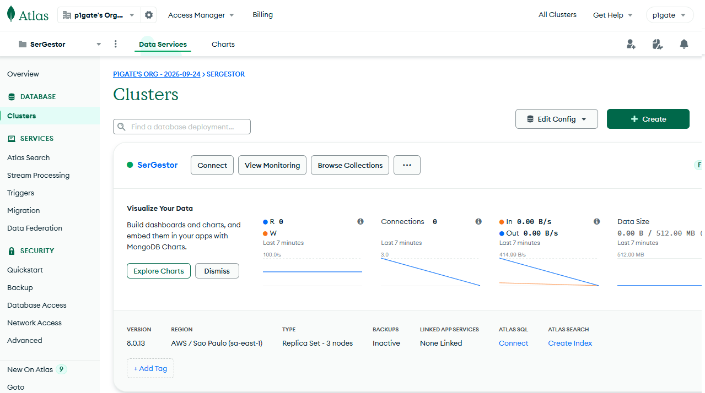
<figcaption>Configurando a conexão com o Atlas </figcaption>

</center> 

   - Escolha o método de conexão: via MongoDB Compass, terminal ou aplicação. 
   - Copie a string de conexão passando as credenciais de acesso
<br>
<center>

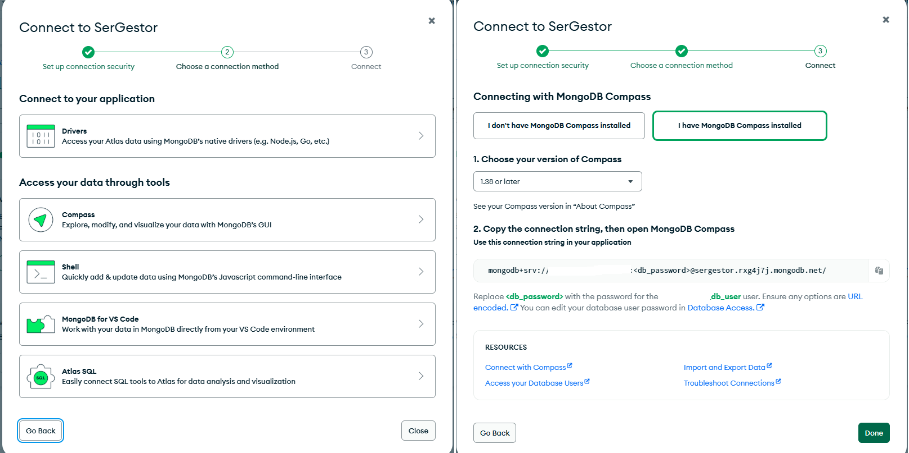
<figcaption>Configurando a conexão com o MongoDB Compass </figcaption>

</center> 
  
  - Uma vez no MongoDB Compass crie uma nova conexão passando a URI

<br>
<center>

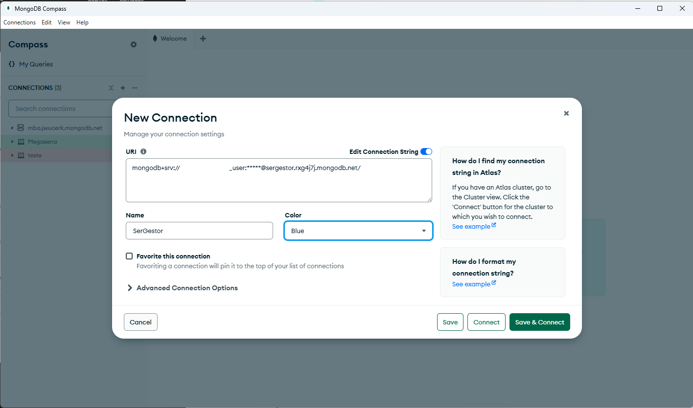
<figcaption>Conectando com o serviço onnline do MongoDB </figcaption>

</center> 


#### Criando e gerenciando bancos e coleções
- Uma vez criada a conexão com o serviço online podemos criar nosso banco de dados e inserir as coleções, para este exemplo iremos criar o DB Empresa e importar as coleções. 

<br>
<center>

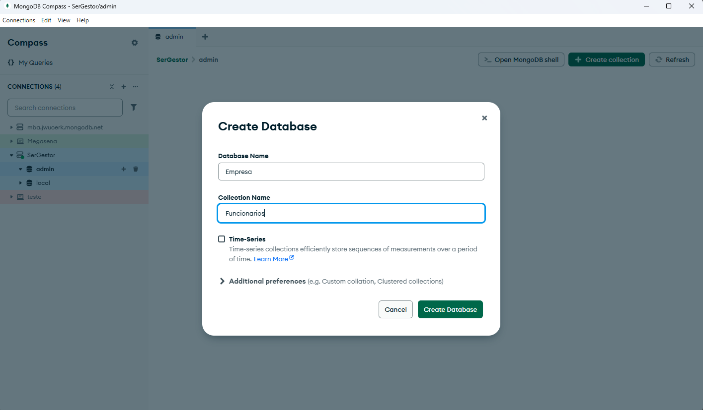
<figcaption>Criando o banco de dados e as coleções </figcaption>

</center> 
 
- importanto os dados de Funcionarios, Montante, Pagamentos e Utilização da verba. 

<br>
<center>

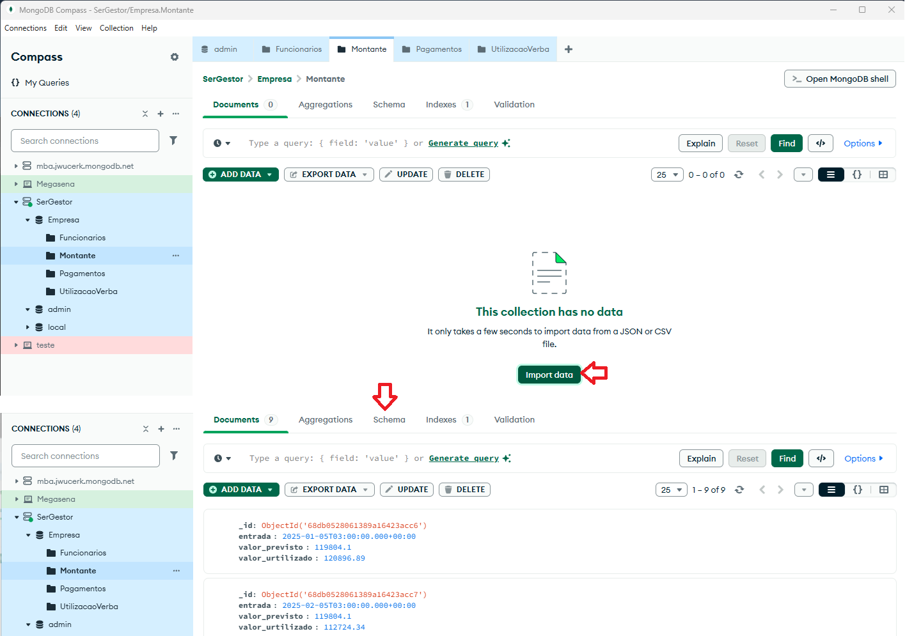
<figcaption>Importanto os dados </figcaption>

</center> 

- Uma vez que nossas coleções são importadas elas ficaram disponiveis em nosso bucket na web

<br>
<center>

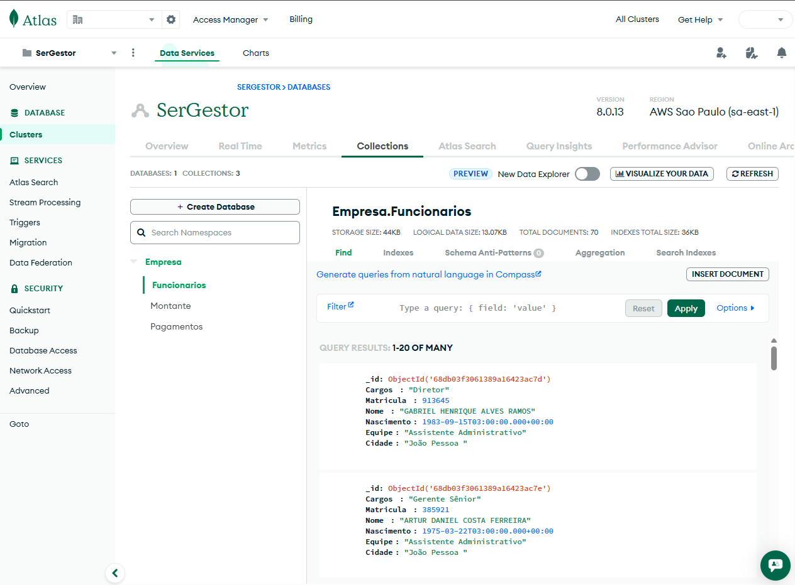
<figcaption>Documentos prontos no cluster </figcaption>

</center> 


### Integração com ferramentas de BI 

- Para esta atividade, será realizada a integração entre o cluster do MongoDB e o Power BI utilizando o conector ODBC (Open Database Connectivity). Essa abordagem se faz necessária devido à limitação da versão gratuita do MongoDB Atlas, que não disponibiliza nativamente conectores compatíveis com ferramentas de Business Intelligence.

> Para proseguir com o porjeto certifique-se que estejam preparados o Database Acess e Network Acess.

- Após as configurações podemos proseguir instalando as aplicações responsavéis por fazer a conexão entre os compontentes. Precisamos fazer as instalações do [Power BI Connector](https://www.mongodb.com/try/download/odbc-driver) e [ODBC Driver](https://www.mongodb.com/try/download/odbc-driver). 

- Inicialmente temos que criar a URI de conexão no cluster, para tanto basta acesssar o cluester do projeto e clicar em connect.

<br>
<center>

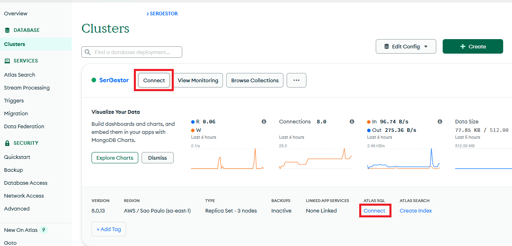
<figcaption>Criando a URI de conexão </figcaption>

</center> 

- Selecione ODBC Driver, escolha uma DB e copie a URL de conexão.

<br>
<center>

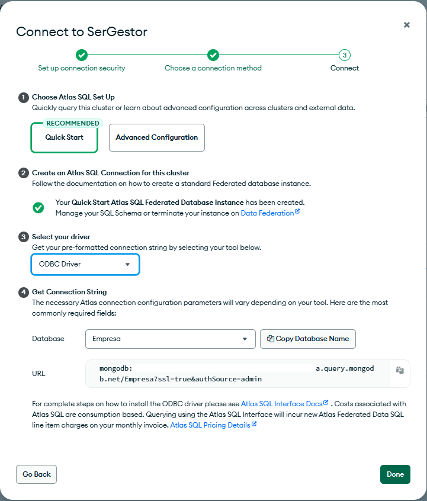
<figcaption>Criando a URL de conexão </figcaption>

</center> 


- Depois de tudo pronto e configurado podemos iniciar a configuração do ODBC no Windows.

<br>
<center>

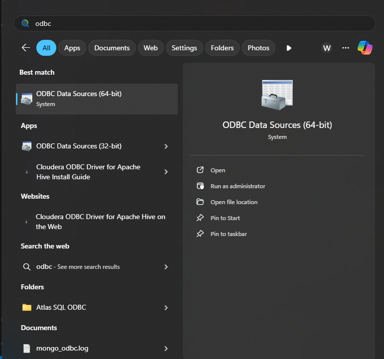
<figcaption>Iniciando o Open Database Connectivity </figcaption>

</center> 

- Selecione System DSN e em seguida Add, selecione o conector "MongoDB Atlas SQL ODBC Driver" e passe suas credenciais de acesso.

<br>
<center>

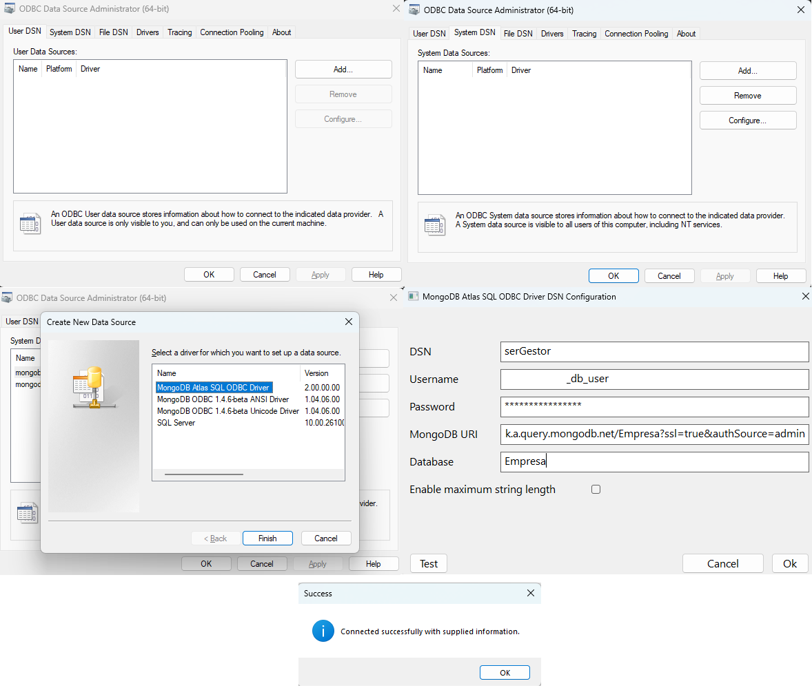
<figcaption>Configuração do ODBC conector </figcaption>

</center> 


### Power BI
- Após a conclusão do processo de instalação e configuração, podemos iniciar a análise dos dados diretamente no Power BI, utilizando a conexão estabelecida com o cluster do MongoDB.

- Uma vez na tela inicla selecione obter os dados e pesquise por ODBC.

<br>
<center>

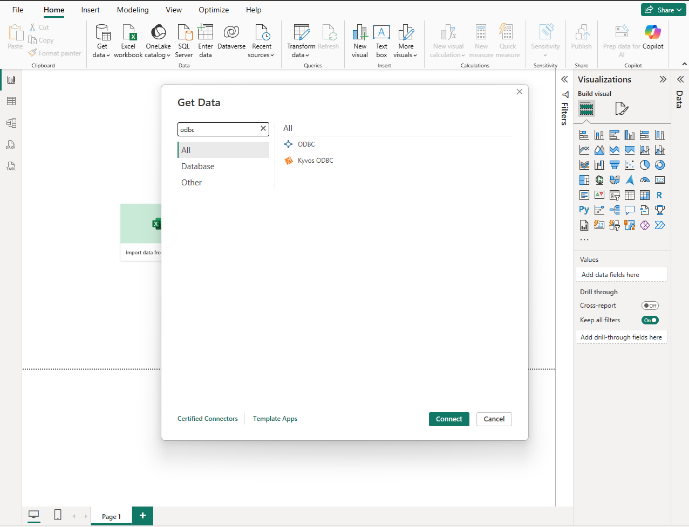
<figcaption>Importando as bases de dados do cluster </figcaption>

</center> 

- Selecione o DSN configurado, e informe suas credenciais de acesso.

<br>
<center>

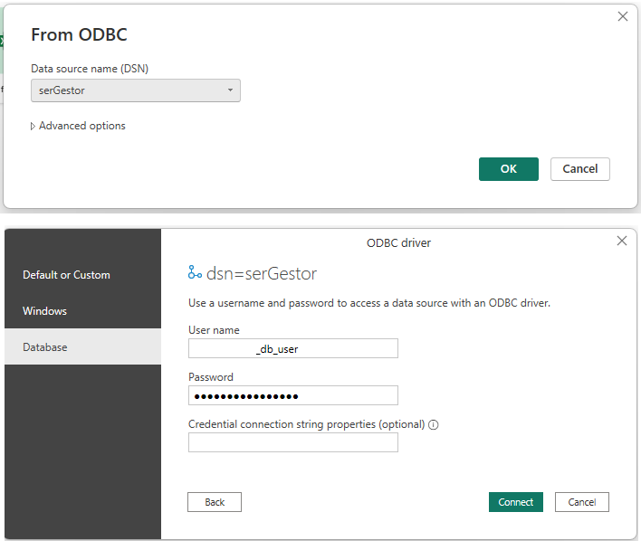
<figcaption>Credenciais de acesso </figcaption>

</center> 

- Selecione as colections necessarias e inicie a sua analise de dados!

<br>
<center>

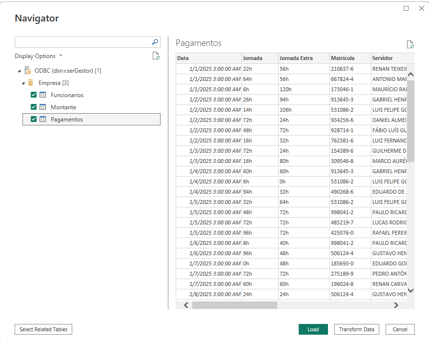
<figcaption>Selecioando as collections </figcaption>

</center> 


### Dashboard

- Por fim, com base nos dados carregados geramos o seguinte report: 

<br>
<center>

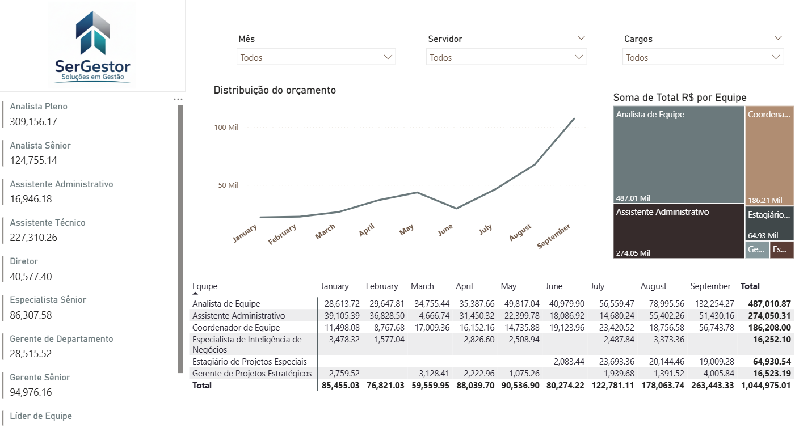
<figcaption>Relatório </figcaption>

</center> 


